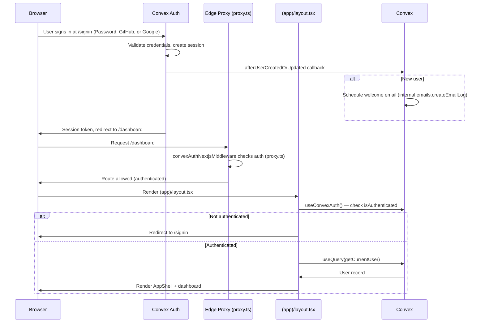
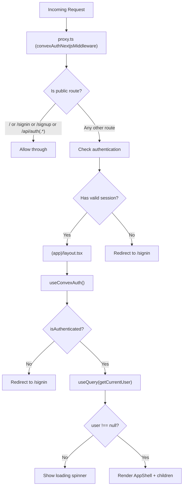
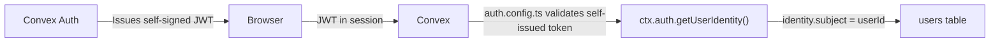
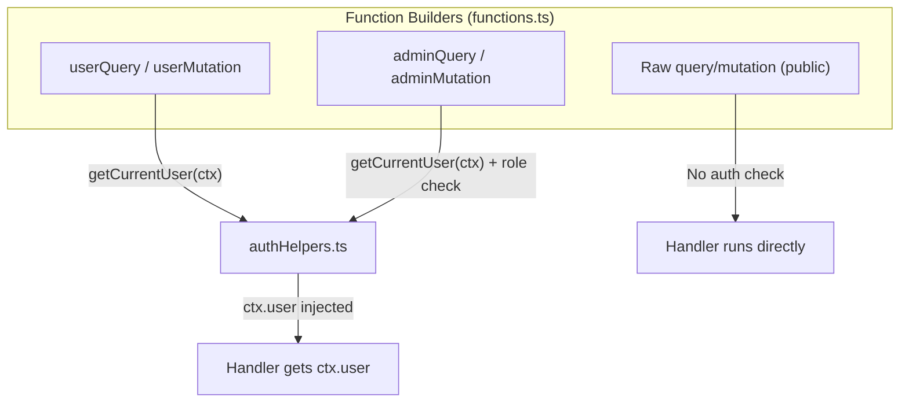

# Authentication Flow

## Sign-In Sequence

## Route Protection

## JWT Flow

## Backend Auth Layers

## Key Files

| File | Role |
|------|------|
| `convex/auth.config.ts` | Self-issued JWT config |
| `convex/auth.ts` | Convex Auth providers (Password, GitHub, Google) + afterUserCreated callback |
| `convex/authHelpers.ts` | Auth guards (getCurrentUser, requireAuth, requireAdmin, hasRole) |
| `convex/functions.ts` | Custom function builders (userQuery, userMutation, adminQuery, adminMutation) |
| `convex/users.ts` | User CRUD (getCurrentUser soft-fail, updateProfile, admin operations) |
| `src/proxy.ts` | Edge proxy — route protection (public vs protected) |
| `src/components/providers.tsx` | ConvexAuthProvider wiring |
| `src/app/(app)/layout.tsx` | Auth gate + user query on mount |
| `src/app/signin/page.tsx` | Sign-in (Password + OAuth) |
| `src/app/signup/page.tsx` | Sign-up (Password + OAuth) |
