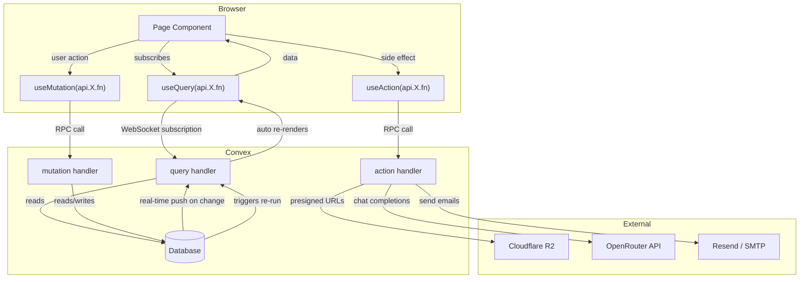
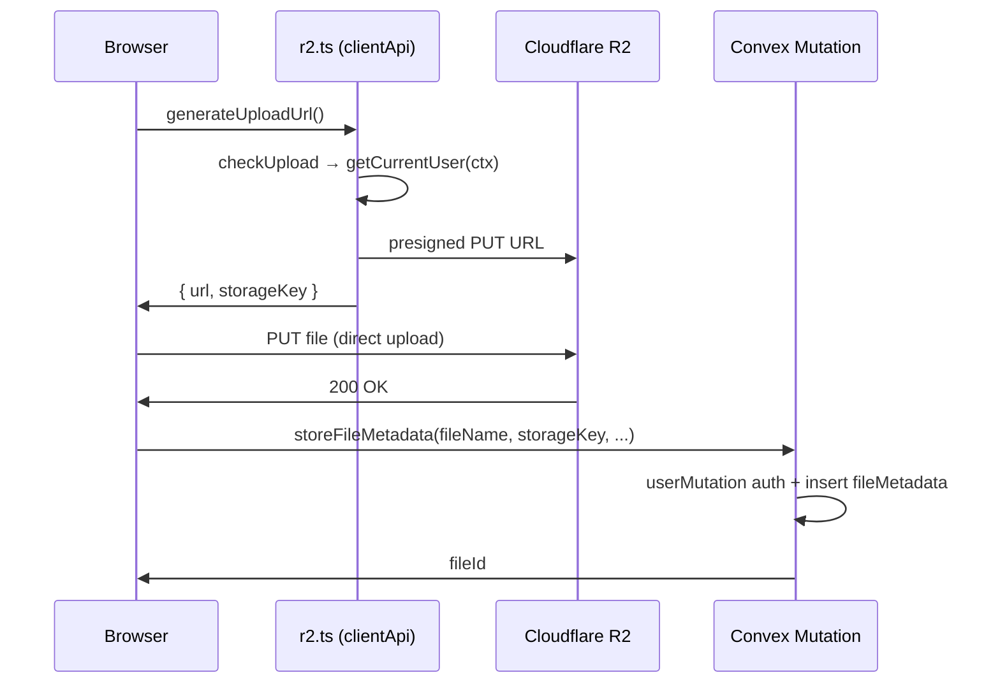
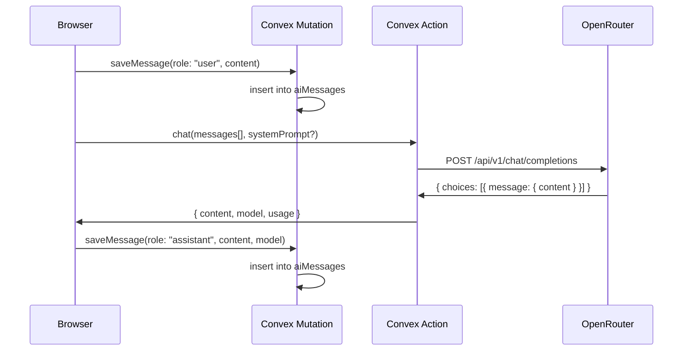
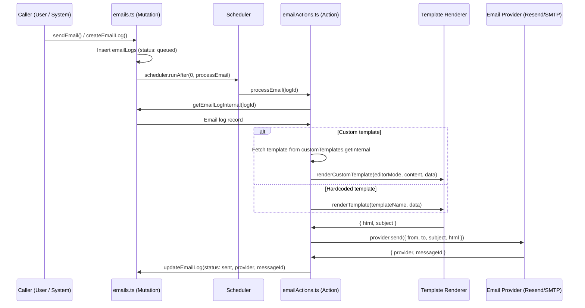
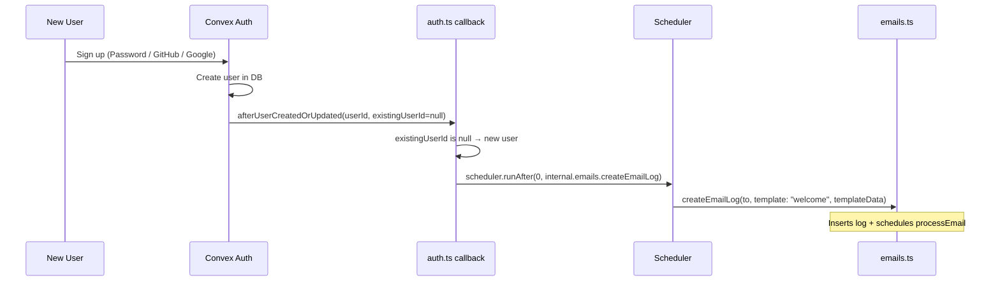
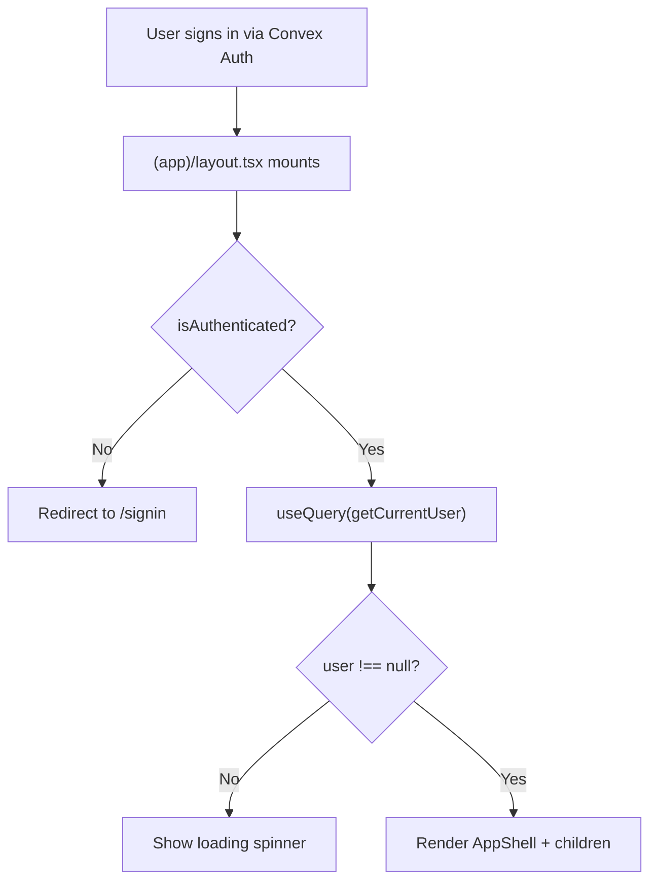
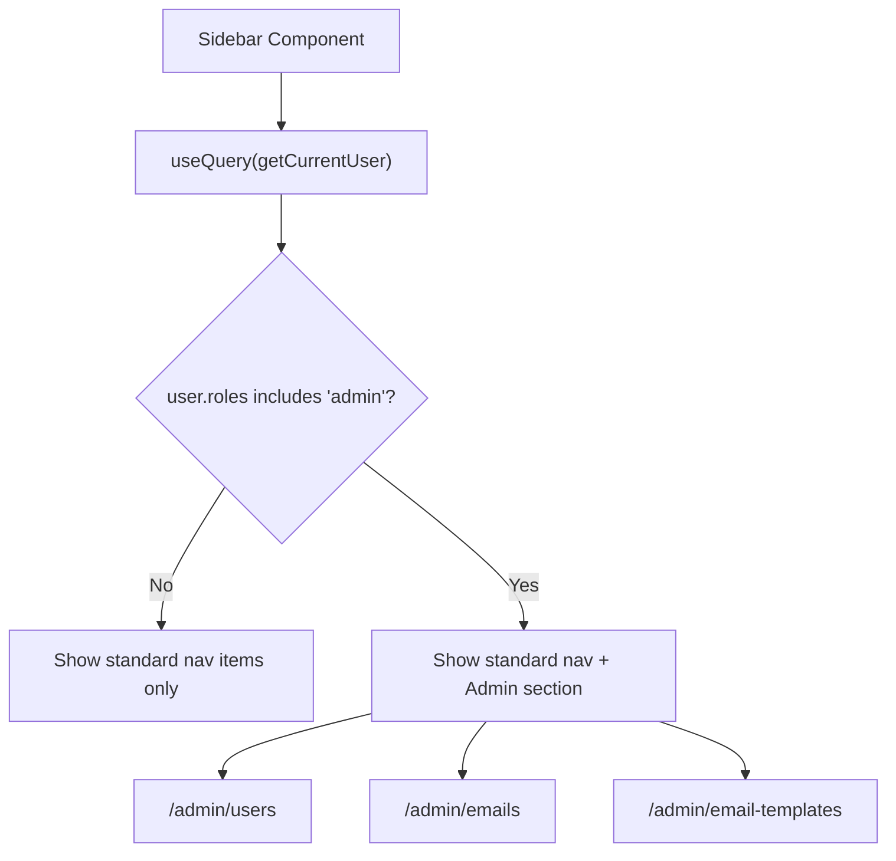

# Data Flow

## Client → Convex Reactive Loop

## R2 File Upload Flow

## AI Chat Flow

## Email Send Flow

## Welcome Email Flow (Auth Callback)

## User Provisioning Flow

## Admin Sidebar Flow

## Key Patterns

| Pattern | Where | How |
|---------|-------|-----|
| Reactive queries | All pages | `useQuery()` auto-updates when data changes |
| Custom function builders | functions.ts | `userQuery`/`userMutation` inject `ctx.user` automatically |
| Admin builders | functions.ts | `adminQuery`/`adminMutation` check admin role + inject `ctx.user` |
| Owner-only writes | notes, files | Check `record.authorId === ctx.user._id` |
| `"use node"` split | r2Actions, aiActions, emailActions | Node packages in separate action-only files |
| Internal functions | emails, customTemplates | `internalMutation`/`internalQuery` for system-triggered operations |
| Scheduler pattern | emails, auth callback | `ctx.scheduler.runAfter(0, ...)` for async processing |
| Presigned URLs | r2.ts (clientApi) | Browser uploads directly to R2, Convex stores metadata |
| External API calls | aiActions, emailActions | Actions can fetch(), queries/mutations cannot |
| Role-based sidebar | sidebar.tsx | `useQuery(getCurrentUser)` → show admin nav items if admin role |
