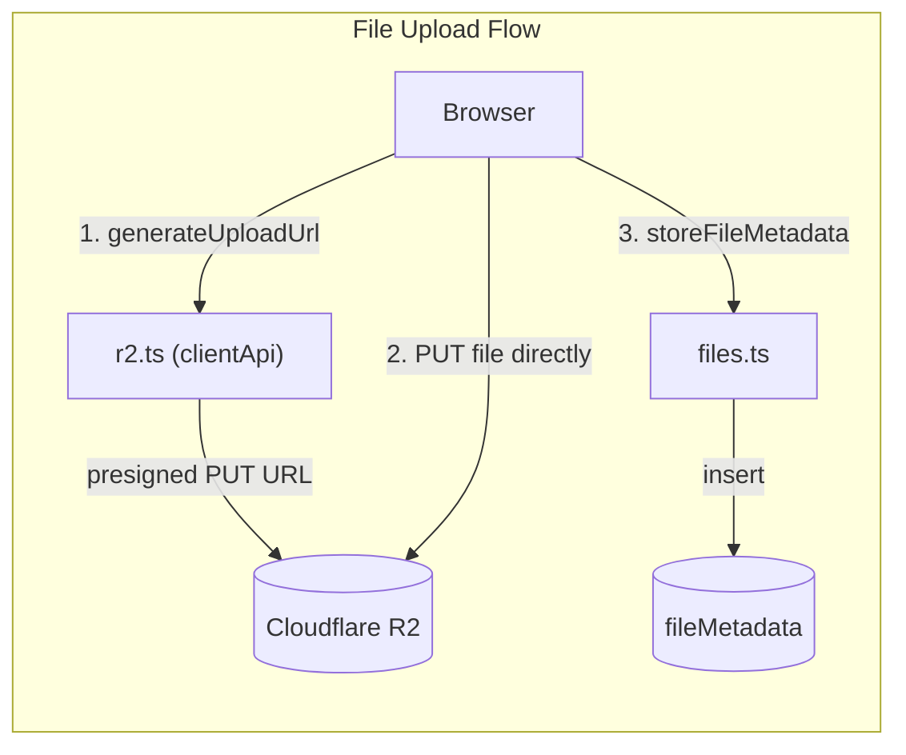
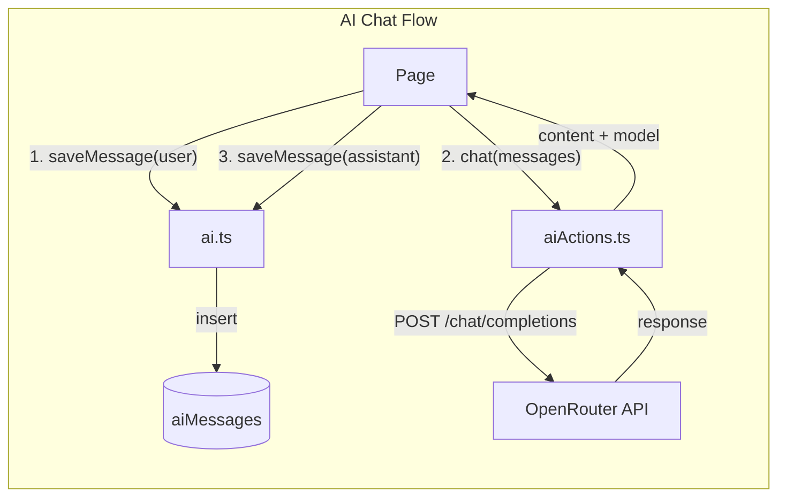
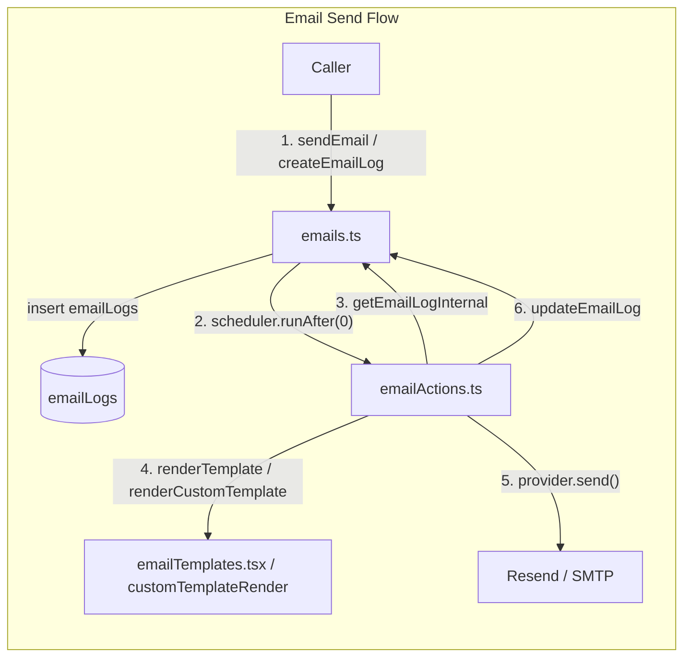

# Convex Functions

## Custom Function Builders (`functions.ts`)

| Builder | Auth | `ctx.user` | Use for |
|---------|------|------------|---------|
| `userQuery` | Authenticated | Yes | Any query needing the current user |
| `userMutation` | Authenticated | Yes | Any mutation needing the current user |
| `adminQuery` | Admin role | Yes | Admin-only reads |
| `adminMutation` | Admin role | Yes | Admin-only writes |
| Raw `query`/`mutation` | **None** | No | Explicitly public endpoints (requires ESLint disable) |

## users.ts

| Function | Type | Auth | Tables | Description |
|----------|------|------|--------|-------------|
| `getCurrentUser` | query (raw) | soft-fail (null if unauthed) | users | Get current user record |
| `updateProfile` | userMutation | authenticated | users | Update own name |
| `updateUserRoles` | adminMutation | admin | users | Change any user's roles |
| `adminUpdateUser` | adminMutation | admin | users | Update another user's profile |
| `getAllUsers` | adminQuery | admin | users | List all users (id, name, email, roles) |

## notes.ts (Demo)

| Function | Type | Auth | Tables | Description |
|----------|------|------|--------|-------------|
| `list` | userQuery | authenticated | notes | Own notes + public notes, deduped, sorted by date |
| `create` | userMutation | authenticated | notes | Create note (title, body, isPublic) |
| `update` | userMutation | authenticated + owner | notes | Update own note |
| `remove` | userMutation | authenticated + owner | notes | Delete own note |

## files.ts (R2 metadata)

| Function | Type | Auth | Tables | Description |
|----------|------|------|--------|-------------|
| `storeFileMetadata` | userMutation | authenticated | fileMetadata | Save metadata after R2 upload |
| `getMyFiles` | userQuery | authenticated | fileMetadata | List current user's files |
| `deleteFile` | userMutation | authenticated + owner | fileMetadata | Delete metadata and R2 object |

## r2.ts (R2 client + clientApi)

| Function | Type | Auth | External | Description |
|----------|------|------|----------|-------------|
| `generateUploadUrl` | clientApi | getCurrentUser (checkUpload) | Cloudflare R2 | Get presigned PUT URL for direct upload |
| `syncMetadata` | clientApi | getCurrentUser (checkUpload) | Cloudflare R2 | Sync file metadata after upload |

## r2Actions.ts (`"use node"` — R2 downloads)

| Function | Type | Auth | External | Description |
|----------|------|------|----------|-------------|
| `generateDownloadUrl` | action | getUserIdentity | Cloudflare R2 | Get presigned GET URL for download |

## ai.ts (Message history)

| Function | Type | Auth | Tables | Description |
|----------|------|------|--------|-------------|
| `listMessages` | userQuery | authenticated | aiMessages | User's chat history |
| `saveMessage` | userMutation | authenticated | aiMessages | Save user or assistant message |
| `clearHistory` | userMutation | authenticated | aiMessages | Delete all user's messages |

## aiActions.ts (`"use node"` — OpenRouter)

| Function | Type | Auth | External | Description |
|----------|------|------|----------|-------------|
| `chat` | action | getUserIdentity | OpenRouter API | Send chat completion, return response |

## emails.ts (Email logs)

| Function | Type | Auth | Tables | Description |
|----------|------|------|--------|-------------|
| `sendEmail` | userMutation | authenticated | emailLogs | Create log + schedule delivery |
| `resendEmail` | adminMutation | admin | emailLogs | Retry a failed email |
| `createEmailLog` | internalMutation | internal | emailLogs | System-triggered email (auth callbacks) |
| `updateEmailLog` | internalMutation | internal | emailLogs | Update log after send attempt |
| `checkIsAdmin` | internalQuery | internal | users | Check if caller is admin (for actions) |
| `getEmailLogInternal` | internalQuery | internal | emailLogs | Read log for send action |
| `listEmailLogs` | adminQuery | admin | emailLogs | Last 500 logs desc by createdAt |

## emailActions.ts (`"use node"` — Email delivery)

| Function | Type | Auth | External | Description |
|----------|------|------|----------|-------------|
| `processEmail` | internalAction | internal | Email provider (Resend/SMTP) | Render template + send via provider |
| `getEmailConfig` | action | admin (manual check) | env vars | Return active provider + config |

## customTemplates.ts (Custom email templates)

| Function | Type | Auth | Tables | Description |
|----------|------|------|--------|-------------|
| `list` | adminQuery | admin | emailTemplates | List all templates desc by createdAt |
| `get` | adminQuery | admin | emailTemplates | Get single template by ID |
| `getInternal` | internalQuery | internal | emailTemplates | Fetch template for send action |
| `create` | adminMutation | admin | emailTemplates | Create template (unique name enforced) |
| `update` | adminMutation | admin | emailTemplates | Update template fields |
| `remove` | adminMutation | admin | emailTemplates | Delete template (blocks if queued emails exist) |
| `duplicate` | adminMutation | admin | emailTemplates | Copy template with auto-generated name |

## auth.ts (Convex Auth config)

| Export | Description |
|--------|-------------|
| `auth` | Auth instance |
| `signIn` | Sign-in handler |
| `signOut` | Sign-out handler |
| `store` | Token store |
| `isAuthenticated` | Auth check |

Providers: Google, GitHub, Password

Callback: `afterUserCreatedOrUpdated` — schedules welcome email via `internal.emails.createEmailLog` for new users.

## authHelpers.ts (Guards)

| Guard | Returns | Throws |
|-------|---------|--------|
| `getCurrentUser(ctx)` | Doc\<users\> | AuthError, NotFoundError |
| `requireAuth(ctx)` | Doc\<users\> | AuthError, NotFoundError |
| `requireAdmin(ctx)` | Doc\<users\> | AuthError, ForbiddenError |
| `hasRole(ctx, role)` | boolean | never (returns false on error) |
