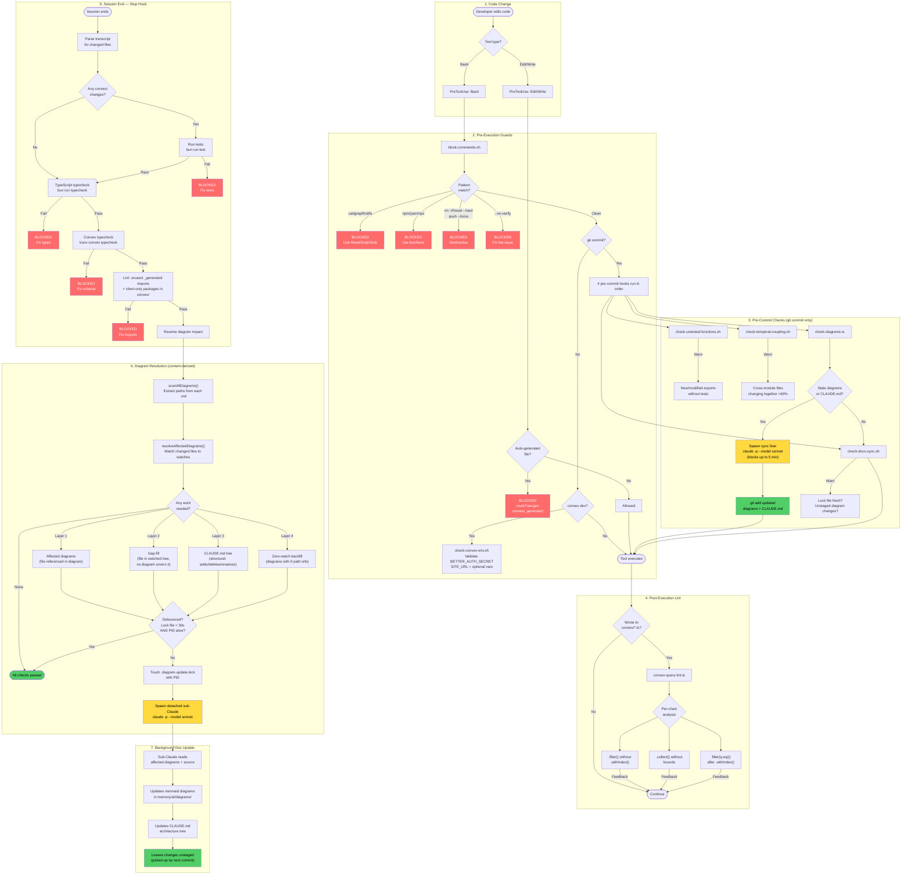
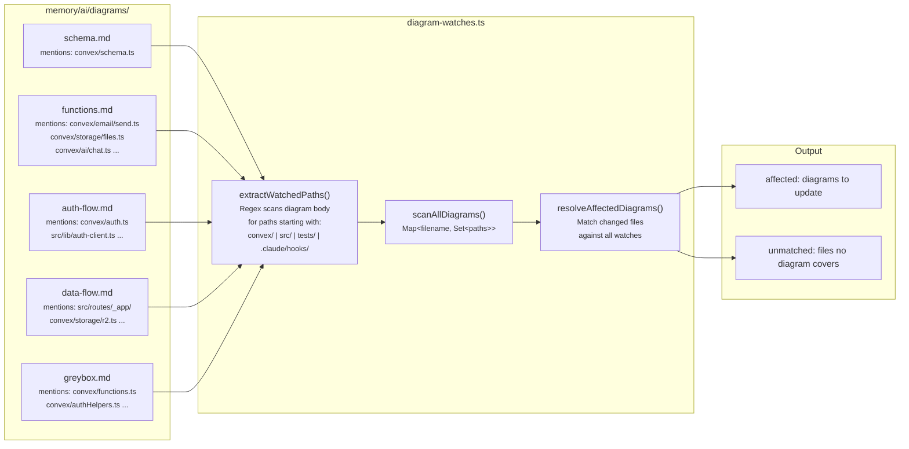
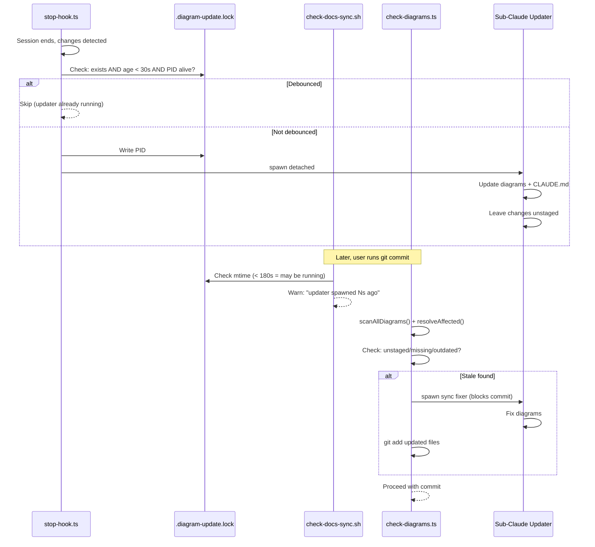

# Hook System — Change Loop & Documentation Alignment

How code changes flow through validation, linting, and automatic documentation updates.

## Overview

Three hook phases enforce correctness and keep docs in sync:

| Phase | Event | When | Purpose |
|-------|-------|------|---------|
| **Guard** | PreToolUse | Before every tool call | Block bad patterns, validate env, check staleness |
| **Lint** | PostToolUse | After every Write/Edit | Catch Convex query anti-patterns per-chain |
| **Sync** | Stop | Session end | Run checks, resolve affected diagrams, spawn updater |

## The Change Loop

## Content-Derived Watch System

How `diagram-watches.ts` resolves which diagrams are affected by a code change — no hardcoded mappings.

## Watched Tree Roots

Paths under these roots participate in the watch system. Adding a root to the array auto-updates the regex — no manual sync.

| Root | What lives there |
|------|-----------------|
| `convex/` | Backend functions, schema, auth |
| `src/routes/` | Frontend pages (file-based routing) |
| `src/components/` | UI components, layout |
| `src/lib/` | Shared utilities (auth-client, utils) |
| `src/hooks/` | React hooks |
| `tests/` | Backend test files |
| `.claude/hooks/` | This hook system itself |

## Lock File Protocol

Prevents concurrent diagram updaters and warns about race windows.

## File Inventory

| File | Type | Event | Blocking | Imports |
|------|------|-------|----------|---------|
| `block-commands.sh` | bash | PreToolUse/Bash | Yes (exit 2) | — |
| `check-convex-env.sh` | bash | PreToolUse/Bash | Yes if required vars missing | — |
| `check-untested-functions.sh` | bash | PreToolUse/Bash | No (warn) | — |
| `check-temporal-coupling.sh` | bash | PreToolUse/Bash | No (warn) | — |
| `check-diagrams.ts` | TypeScript | PreToolUse/Bash | Sync fix + stage | `diagram-watches.ts` |
| `check-docs-sync.sh` | bash | PreToolUse/Bash | No (warn) | reads `.diagram-update.lock` |
| `convex-query-lint.ts` | TypeScript | PostToolUse/Write\|Edit | No (feedback) | — |
| `stop-hook.ts` | TypeScript | Stop | Yes if checks fail | `diagram-watches.ts` |
| `diagram-watches.ts` | TypeScript | (library) | — | — |
| `.claude/rules/convex-queries.md` | Markdown | Session start | — | — |
