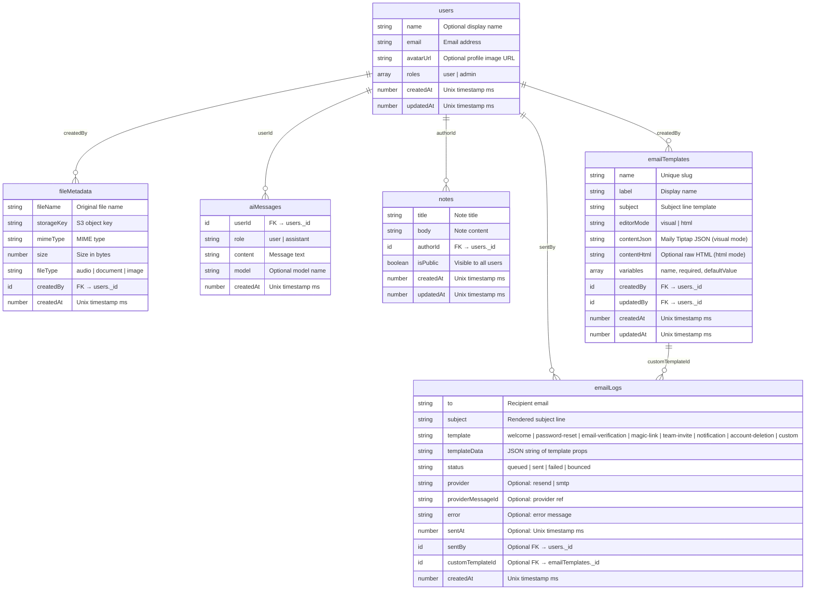

# Database Schema

## Indexes

| Table | Index | Fields | Purpose |
|-------|-------|--------|---------|
| users | by_email | email | Email lookup |
| fileMetadata | by_created_by | createdBy | User's files |
| fileMetadata | by_file_type | fileType | Filter by type |
| aiMessages | by_user | userId | User's chat history |
| notes | by_author | authorId | User's own notes |
| notes | by_public | isPublic | Public notes feed |
| emailLogs | by_status | status | Filter by send status |
| emailLogs | by_template | template | Filter by template type |
| emailLogs | by_to | to | Lookup by recipient |
| emailLogs | by_created_at | createdAt | Chronological listing |
| emailTemplates | by_name | name | Unique name lookup |
| emailTemplates | by_created_at | createdAt | Chronological listing |

## Roles

| Role | Description |
|------|-------------|
| user | Default role for all new users |
| admin | Full access, can manage user roles |

## Validators (exported from schema.ts)

| Validator | Values |
|-----------|--------|
| `roleValidator` | `"user"` \| `"admin"` |
| `fileTypeValidator` | `"audio"` \| `"document"` \| `"image"` |
| `messageRoleValidator` | `"user"` \| `"assistant"` |
| `emailStatusValidator` | `"queued"` \| `"sent"` \| `"failed"` \| `"bounced"` |
| `emailTemplateValidator` | `"welcome"` \| `"password-reset"` \| `"email-verification"` \| `"magic-link"` \| `"team-invite"` \| `"notification"` \| `"account-deletion"` \| `"custom"` |
